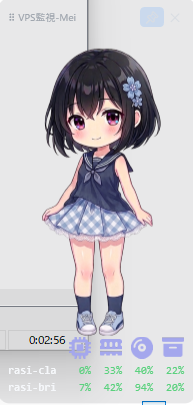
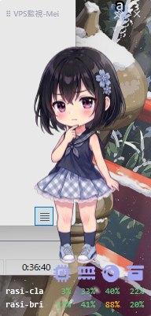
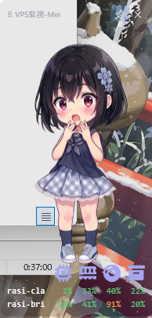

# VPS監視-Mei

N台の Ubuntu VPS の CPU / メモリ / ストレージ / ネットワークを、Windows デスクトップに常駐するガジェットで **1Hz リアルタイム表示**する監視アプリ。状態をキャラクターの表情で示し、しきい値超過時に VOICEPEAK 音声で警告する。

- 監視される側に負担をかけない **低負荷最優先**設計（アイドル時 CPU ほぼ 0%）。
- 公開ポートを増やさず、既存 **SSH（鍵認証・forced-command）**のみで到達。
- 監視対象は設定追加だけで増やせ（N台可変）、パネルはドラッグで並べ替え可能。

> 詳細仕様は [`docs/design.md`](docs/design.md)（設計書・正典）を参照。

## デモ

https://github.com/user-attachments/assets/fcf5580e-3e98-4cbb-94e1-04b0993829cf

| 通常時 | 注意（ディスク 88%） | 警告（ディスク 91%） |
|---|---|---|
|  |  |  |

全サーバ中の最悪の状態に応じて Mei の表情が変わり（穏やか → 心配 → 驚き）、各メトリクスの数値はしきい値レベルごとに色分けされる。立ち絵・背景・音声・しきい値はすべて差し替え・調整できる。

---

## 構成（2コンポーネント）

| ディレクトリ | 内容 | 技術 | 配布形態 |
|---|---|---|---|
| [`agent/`](agent/) | サーバ側エージェント。`/proc`・`statfs` を直接読み、NDJSON を 1行/秒で stdout へ流すステートレスなストリーム。 | **Go 静的バイナリ**（`CGO_ENABLED=0`） | GitHub Releases（amd64 / arm64） |
| [`client/`](client/) | Windows クライアント。SSH exec で各 VPS の stdout を受け、数値・バー・キャラ表情・音声で表示。 | **C# / .NET LTS / WPF** | GitHub Releases（self-contained 単一 exe） |

両者が交換するデータ形式は [`docs/ndjson-schema.md`](docs/ndjson-schema.md) ＋ [`testdata/sample.ndjson`](testdata/sample.ndjson) を**単一の真実**として固定する。

---

## 全体像

```
  ┌────────────── Ubuntu VPS（N台） ──────────────┐        ┌─────── Windows ───────┐
  │  agent（Go 静的バイナリ）                       │        │  VpsWatcher.App.exe    │
  │   /proc・statfs を直接 read → NDJSON 1行/秒     │  SSH   │   （self-contained WPF）│
  │   listen しない・常駐しない                       │ ◀────  │   各VPSへSSH接続し表示  │
  │   SSH接続中だけ起動し stdout へ流す               │  exec  │   数値・バー・キャラ・音声│
  └───────────────────────────────────────────────┘        └────────────────────────┘
```

- **VPS 側**で `agent` を設置（SSH の forced-command に束縛）→ **Windows 側**でクライアントを起動し、各 VPS へ SSH 接続して NDJSON を受け取り表示する。
- 公開ポートは増えない。到達経路は既存の SSH（鍵認証）のみ。
- 導入は **(A) VPS 側エージェント設置** → **(B) Windows クライアント導入** の順。両方とも GitHub Releases（タグ `vX.Y.Z`）から取得し、SHA256 で完全性を検証してから使う。

---

## 導入

### サーバ側エージェント（Go）

GitHub Releases から取得し、SHA256 で改ざん検証してから配置する:

まず自分の VPS のアーキテクチャを確認する（`uname -m` の結果が `x86_64` なら amd64、`aarch64` なら arm64）。以下は **amd64** の例。arm64 の場合は `agent-linux-amd64` を `agent-linux-arm64` に読み替える（`.sha256` も同様）。

```sh
# 配置先ディレクトリを用意
sudo mkdir -p /opt/vpswatcher

cd /tmp
# バイナリと SHA256 を「元のファイル名のまま」両方ダウンロード
curl -fsSLO https://github.com/onevilection/vpswatcher/releases/latest/download/agent-linux-amd64
curl -fsSLO https://github.com/onevilection/vpswatcher/releases/latest/download/agent-linux-amd64.sha256

# 改ざん検証（.sha256 内のファイル名と一致するので検証が通る）
sha256sum -c agent-linux-amd64.sha256

# 検証が OK になってから配置（実行権限付与も同時）
sudo install -m 755 agent-linux-amd64 /opt/vpswatcher/agent
```

arm64（aarch64）の場合は、上記の `agent-linux-amd64` を `agent-linux-arm64` に読み替えて同じ手順を実行する。

> 💡 上の URL の `releases/latest/download/` は**常に最新リリース**を指す。特定バージョンに固定したいときは `latest` をタグに置き換える（例: `releases/download/v0.1.0/agent-linux-amd64`）。`.sha256` も同じパスで取得する。最初の公開版は **v0.1.0**。

#### 起動モデル（重要）

エージェントは**常駐サービスではない**。`cron` も `systemd` ユニットも不要で、自分でデーモン化もしない。

- クライアントが **SSH で接続したときだけ起動**し、1Hz で NDJSON を stdout へ流す。
- **SSH 切断（セッション終了）で自動的に終了**する。プロセスを残さない。
- **listen しない**：開くポートは増えない。到達経路は既存の SSH のみ。

#### 監視専用ユーザと鍵の設定

監視専用の低権限ユーザを作り、その `authorized_keys` に **forced-command** で監視鍵を束縛する（鍵が漏れてもシェルを取らせない）。`/proc`・`statfs` は world-readable なので **sudo 不要・root 不要**で全項目を取得できる。

```sh
# 監視専用ユーザを作成（forced-command 実行のためログインシェルは bash）
sudo useradd --create-home --shell /bin/bash metrics
```

> ⚠️ シェルは `/bin/bash`（`/usr/sbin/nologin` にしないこと）。forced-command はログインシェルを経由して実行されるため、nologin だとシェルが先に接続を蹴り、agent まで到達せず `This account is currently not available.` で失敗する。対話シェルや任意コマンドの実行は forced-command の `no-pty` 等が封じるので、シェルが bash でも安全性は保たれる。

クライアント側で用意した監視用**公開鍵**（次節「Windows クライアント」で生成）を、`metrics` ユーザの `~/.ssh/authorized_keys` に forced-command 付きで 1 行で登録する。

```sh
# metrics ユーザの .ssh を用意（初回のみ・権限が重要）
sudo mkdir -p /home/metrics/.ssh
sudo chmod 700 /home/metrics/.ssh

# forced-command 付きで公開鍵を 1 行追記する
# ↓ 「ssh-ed25519 AAAA... watcher-client」の部分を、watcher_ed25519.pub の中身そのものに置き換える
echo 'command="/opt/vpswatcher/agent --id=vps-example-1",no-pty,no-port-forwarding,no-X11-forwarding,no-user-rc ssh-ed25519 AAAA... watcher-client' \
  | sudo tee -a /home/metrics/.ssh/authorized_keys

# 権限と所有者を SSH の要求どおりに整える
sudo chmod 600 /home/metrics/.ssh/authorized_keys
sudo chown -R metrics:metrics /home/metrics/.ssh
```

> ⚠️ `sudo echo '...' >> ファイル` は使わない。`sudo` はリダイレクト（`>>`）に効かず、`metrics` 所有のファイルへの書き込みが Permission denied になる。上記のように `sudo tee -a` を使う。
> ⚠️ SSH は `~/.ssh`=700・`authorized_keys`=600・所有者=`metrics` でないと鍵を拒否する。上記の `chmod`/`chown` は必須。

- `--iface`/`--mounts` は**省略可**。省略時はデフォルトルートの NIC を自動判定し、ディスクは `/` を対象とする。複数マウントや IF 固定が必要なときだけ明示する。
- forced-command の各オプションの意味・フラグ詳細・セキュリティ設計は設計書 [§3.6](docs/design.md) / [§4](docs/design.md) を参照。

### Windows クライアント（WPF）

#### 監視用 SSH 鍵の準備

監視専用の SSH 鍵ペアを作る（無人で自動接続するためパスフレーズ無し）。PowerShell で:

```powershell
ssh-keygen -t ed25519 -f "$env:USERPROFILE\.ssh\watcher_ed25519" -N '""' -C "watcher-client"
```

生成された**公開鍵** `watcher_ed25519.pub` の中身を、各 VPS の `metrics` ユーザの forced-command 付き `authorized_keys` に登録する（前節「監視専用ユーザと鍵の設定」）。**秘密鍵** `watcher_ed25519` はクライアント端末から持ち出さない。

> ⚠️ **パスフレーズ無し鍵のリスク**: パスフレーズを付けていないため、秘密鍵ファイルが漏れると監視接続を再現される。forced-command で「エージェント起動のみ」に束縛しているのでシェルや任意コマンドは取られないが、秘密鍵ファイル自体の保護（`$env:USERPROFILE\.ssh` のアクセス権・端末の管理）は利用者の責任。より厳密にするならパスフレーズ＋ssh-agent を検討する。

#### 接続確認（agent の起動テスト）

アプリ導入前に、SSH で agent が起動することを手動確認する。PowerShell で（`<host>` は VPS のホスト名/IP、`<port>` は SSH ポート）:

```powershell
ssh -i "$env:USERPROFILE\.ssh\watcher_ed25519" -p <port> metrics@<host>
```

- `<port>` は各自の SSH ポートに置き換える（**デフォルトは 22**。変更している場合はその番号）。
- 初回接続時は**ホスト鍵の確認**を求められる。表示されたフィンガープリントが正しいことを確認してから受け入れる（このホスト鍵はクライアントが後でピン留め検証に使う。設計書 §4）。
- 成功すると NDJSON が 1 行/秒で流れ出す。**1 行目はレート系（`cpu_pct`/`rx_bps`/`tx_bps`）が `null`（測定中）**、2 行目以降が実値になる。`Ctrl+C` で停止する。

#### クライアントアプリ（WPF）の入手と実行

GitHub Releases の **v0.1.0** から self-contained 単一 exe をダウンロードして実行する。

1. **ダウンロード**: [Releases](https://github.com/onevilection/vpswatcher/releases) の v0.1.0 から `VpsWatcher.App.exe` と `VpsWatcher.App.exe.sha256` の**両方**を取得する。

2. **SHA256 で完全性を検証**（agent 側の `sha256sum -c` と同じ思想）。PowerShell で 2 つの値が一致することを確認する:

   ```powershell
   # exe の実ハッシュ
   (Get-FileHash VpsWatcher.App.exe -Algorithm SHA256).Hash.ToLower()
   # 期待値（.sha256 の中身。先頭のハッシュ値部分）
   Get-Content VpsWatcher.App.exe.sha256
   ```

   表示された 2 つのハッシュ値が一致すれば改ざんされていない。一致しない場合は使わず、ダウンロードし直す。

3. **実行**: self-contained（.NET ランタイム同梱）なので、**.NET のインストールは不要**。`VpsWatcher.App.exe` をそのままダブルクリックで起動できる。

- ⚠️ **SmartScreen 警告**: 署名なし exe のため初回起動時に保護警告が出る。自分用／少人数なら「詳細情報 → 実行」で続行可。
- ⚠️ **サイズ**: .NET ランタイム同梱のため ~170MB になる（ゼロインストールとのトレードオフ）。

#### 初回設定（servers.json）

監視対象 VPS は `%APPDATA%\VpsWatcher\servers.json` に**配列**で定義する（テンプレートは [`servers.example.json`](servers.example.json)）。各要素のフィールド:

| フィールド | 内容 |
|---|---|
| `id` | サーバ識別子（agent の forced-command の `--id` と一致させる） |
| `label` | 表示名（任意） |
| `host` / `port` | VPS のホスト名/IP と SSH ポート |
| `user` | 監視専用ユーザ（= `metrics`） |
| `keyPath` | 監視用秘密鍵のパス（= `%USERPROFILE%\.ssh\watcher_ed25519`） |
| `knownHostKey` | **ピン留めするホスト鍵**（MITM 防止。接続確認時に表示された鍵を設定） |
| `iface` / `mounts` | 監視する NIC / マウント（任意。省略時は自動判定） |
| `thresholds` | しきい値（**任意**。未設定ならデフォルト適用。下の「設定」節を参照） |

詳細は下の「設定」節と設計書 §9.1。

#### 任意設定（appearance.json）

外観・音声は `%APPDATA%\VpsWatcher\appearance.json` でカスタマイズできる（テンプレートは [`appearance.example.json`](appearance.example.json)）。表情マップ・アラート音声マップ・背景不透明度（`background_opacity`）・音量（`master_volume`）・クリック時の音を設定する。**未設定なら exe 同梱のデフォルト**が使われるので、最初は置かなくてよい。

#### 起動・操作

起動すると、デスクトップに透過ガジェットが常駐する。

- **移動**: パネルを**ドラッグ**して好きな位置へ。
- **最前面ピン留め**: 最前面固定の ON/OFF を切り替えられる（状態は記憶される）。
- **終了**: `×` で終了。
- **ステータス読み上げ**: **キャラクターをクリック**すると、現在の最悪状態を音声で読み上げる。

---

## 設定

- サーバ定義: `%APPDATA%\VpsWatcher\servers.json`（テンプレートは [`servers.example.json`](servers.example.json)）。
  - `thresholds` は**任意**。未設定（または一部メトリクス欠落・不正値）なら設計書 §6.2 のデフォルト（cpu `[70,85,95]` / mem `[75,88,95]` / disk `[80,90,95]` / swap `[25,50,80]`）が自動適用される。明示すればサーバ単位で上書き可。
- アプリ設定・UI状態（最前面ON/OFF・並べ替え順・ウィンドウ位置）: `%APPDATA%\VpsWatcher\state.json`。
- 外観・音声（キャラ表情マップ・背景不透明度・音声マップ・音量）: `%APPDATA%\VpsWatcher\appearance.json`（テンプレートは [`appearance.example.json`](appearance.example.json)）。`background_opacity` が 0.3 未満のときは文字色を自動で濃色に切り替える。`sounds`/`master_volume`/`click` でアラート音声・音量・クリック時の音を設定（未設定なら同梱デフォルト）。表情PNG・音声WAVは `%APPDATA%\VpsWatcher\assets\char` / `…\assets\voice` に同名ファイルを置けば差し替え可。キャラをクリックすると現在の状態を読み上げる。
- **実サーバの IP・SSH 鍵・ホスト鍵・実 `servers.json` はリポジトリにコミットしない**（公開リポジトリ）。リポジトリにはダミー値の `servers.example.json` のみ置く。

---

## 開発

- ランタイムで分業: `agent/` は Linux（dev VPS）で、`client/` は Windows で開発・テスト（設計書 §15）。
- ブランチモデルは **GitHub Flow**。`main` は常にビルド可能な統合ブランチ。公開物は `main` の良コミットに付けた SemVer タグ（`vX.Y.Z`）から CI が生成する Release。
- スキーマ契約に触れる変更は `docs/ndjson-schema.md` と `testdata/sample.ndjson` を**同時更新**し、両側テストを通すこと。

### クライアントのビルド / 発行（Windows）

```sh
# ビルド & テスト
dotnet build  client/VpsWatcher.sln -c Release
dotnet test   client/VpsWatcher.sln

# 配布物（self-contained 単一 exe・win-x64・.NET 同梱）を発行
dotnet publish client/VpsWatcher.App -p:PublishProfile=win-x64
```

- 発行プロファイル: [`client/VpsWatcher.App/Properties/PublishProfiles/win-x64.pubxml`](client/VpsWatcher.App/Properties/PublishProfiles/win-x64.pubxml)（`SelfContained` / `PublishSingleFile` / trimming なし / ネイティブDLL自己展開）。
- 出力: `client/VpsWatcher.App/bin/Release/net8.0-windows/win-x64/publish/VpsWatcher.App.exe`（.NET ランタイム同梱のため **~170MB**。これは正常）。アイコン・キャラ・音声は exe 内リソースに同梱され、ユーザー側 `%APPDATA%\VpsWatcher\assets\…` に同名ファイルを置けば差し替え可。
- 配布: この exe を GitHub Releases（タグ `vX.Y.Z` 連動）に添付して配る。利用者は Release から取得して実行（SmartScreen 警告は「詳細情報 → 実行」で続行）。発行物バイナリはリポジトリにコミットしない。
- タグ打ち・SHA256 生成・Release への手動添付の具体手順は [`docs/release.md`](docs/release.md)（リリース手順）を参照。

---

## ライセンス

本体 MIT（予定）。依存 `gong-wpf-dragdrop`（BSD-3-Clause）・`OxyPlot`（MIT）と両立。詳細は [`LICENSE`](LICENSE)。
